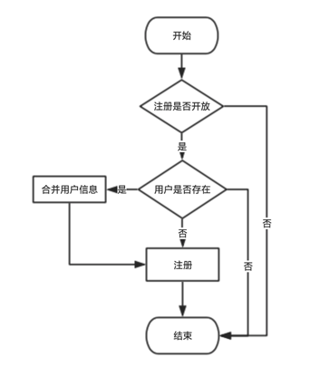
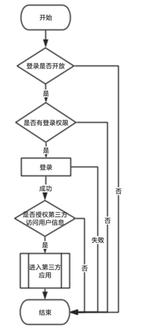

i1c（i1-Consumer）
====

### 项目介绍
i1c 是一个提供定制化登录注册功能，并可以对第三方应用提供登录授权的一个用户系统。  

### 基本功能
- 作为单点登录 server 对外提供授权服务
- 配置站点登录表单
- 配置站点注册表单
- 生成外网可访问的登录链接和注册链接

### 流程

#### 注册流程


#### 登录授权流程



### 环境要求
- PHP >= 7.1
- mysql >= 5.6
- nginx >= 2.3

### 扩展要求
- ext-ctype: *
- ext-dom: *
- ext-gd: *
- ext-iconv: *
- ext-libxml: *
- ext-mbstring: *
- ext-simplexml: *
- ext-xml: *
- ext-xmlreader: *
- ext-xmlwriter: *
- ext-zip: *
- ext-zlib: *
- ext-mcrypt: *
- psr/simple-cache: ^1.0
- markbaker/complex: ^1.4.1

### 其他配置说明
如需要发送邮件功能，请配置 .env 中的「环境配置」相关参数
发送短信功能，请配置 .env 中的「短信配置」相关参数  
*短信功能使用腾讯云短信服务


### 安装
前端项目克隆在同级目录下，并命名为 i1c_front 即可

配置更改完成之后，在后端应用文件夹执行以下命令来初始化安装应用

````bash
# 生成 key
 php artisan key:generate
# 初始化应用
 php artisan app:init
````
